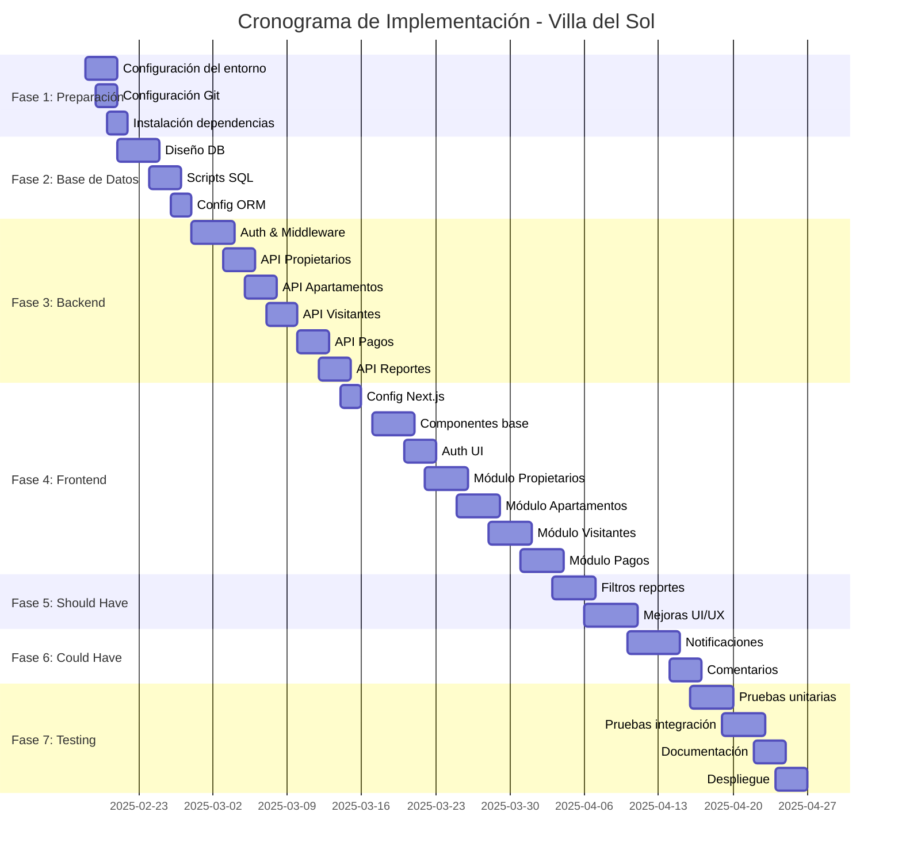

# Cronograma del Proyecto

```mermaid
gantt
    title Cronograma de Implementación - Villa del Sol
    dateFormat YYYY-MM-DD
    section Fase 1: Preparación
    Configuración del entorno:2025-02-18,3d
    Configuración Git:2025-02-19,2d
    Instalación dependencias:2025-02-20,2d

    section Fase 2: Base de Datos
    Diseño DB:2025-02-21,4d
    Scripts SQL:2025-02-24,3d
    Config ORM:2025-02-26,2d

    section Fase 3: Backend
    Auth & Middleware:2025-02-28,4d
    API Propietarios:2025-03-03,3d
    API Apartamentos:2025-03-05,3d
    API Visitantes:2025-03-07,3d
    API Pagos:2025-03-10,3d
    API Reportes:2025-03-12,3d

    section Fase 4: Frontend
    Config Next.js:2025-03-14,2d
    Componentes base:2025-03-17,4d
    Auth UI:2025-03-20,3d
    Módulo Propietarios:2025-03-22,4d
    Módulo Apartamentos:2025-03-25,4d
    Módulo Visitantes:2025-03-28,4d
    Módulo Pagos:2025-03-31,4d
    
    section Fase 5: Should Have
    Filtros reportes:2025-04-03,4d
    Mejoras UI/UX:2025-04-06,5d
    
    section Fase 6: Could Have
    Notificaciones:2025-04-10,5d
    Comentarios:2025-04-14,3d
    
    section Fase 7: Testing
    Pruebas unitarias:2025-04-16,4d
    Pruebas integración:2025-04-19,4d
    Documentación:2025-04-22,3d
    Despliegue:2025-04-24,3d
```
